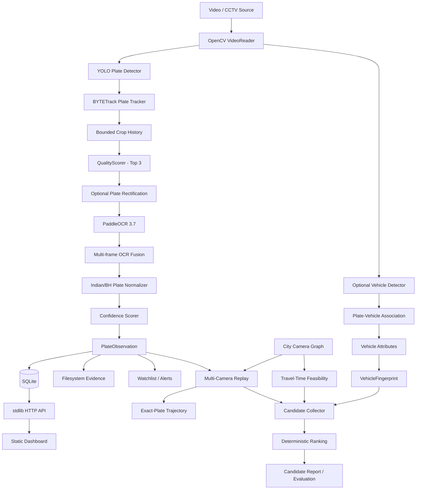

# CitySight

### City-Wide AI Engine for Multi-Camera ANPR Trajectory Tracking and Urban Traffic Analytics

**Smart India Hackathon 2026 · Problem Statement 26127 · Bharat Electronics Limited (BEL)**  
**Theme:** Transportation & Logistics

<p align="left">
  
  
  
  
  
</p>

> **CitySight** is a lightweight, modular and explainable multi-camera ANPR system that converts CCTV/video streams into confidence-aware plate observations, reconstructs vehicle trajectories across cameras, and retrieves plausible cross-camera vehicle matches using plate evidence, vehicle attributes, camera topology and physical travel-time constraints.

---

## Problem Statement

Traditional ANPR systems often operate camera-by-camera. A plate may be detected at one location, but answering questions such as:

- Where was this vehicle seen next?
- Which cameras observed the same vehicle?
- Is a proposed cross-camera match physically possible?
- What should the system do when OCR is uncertain?
- Can the result be explained to an operator instead of returning a black-box score?

requires more than single-frame OCR.

CitySight addresses this by building a **city-level evidence and correlation layer** over camera feeds. The system does not treat every OCR result as truth. It combines temporal evidence, validates Indian number-plate formats, preserves uncertainty, reconstructs exact-plate trajectories, and ranks cross-camera candidates using explainable rules.

---

## Core Idea

```text
Camera / Recorded Video
        │
        ▼
  YOLO Plate Detection
        │
        ▼
     BYTETrack
        │
        ▼
Bounded Crop History
        │
        ▼
 Top-K Quality Frames
        │
        ▼
Plate Rectification
        │
        ▼
   PaddleOCR 3.7
        │
        ▼
 Multi-frame Fusion
        │
        ▼
Indian/BH Normalization
        │
        ▼
Confidence Decision
(Accept / Review / Abstain)
        │
        ▼
 PlateObservation + Evidence
        │
        ├──────────────► Watchlist / Alerts
        │
        ├──────────────► HTTP API / Dashboard
        │
        ▼
Multi-Camera Replay + Camera Graph
        │
        ▼
Trajectory Reconstruction
        │
        ▼
Vehicle Attributes + Fingerprint
        │
        ▼
Physical Feasibility + Candidate Ranking
        │
        ▼
Explainable Cross-Camera Candidate Report
```

---

## What Makes CitySight Different

### 1. Track-Level ANPR Instead of OCR on Every Frame

The system tracks a visible plate across multiple frames and performs OCR only on a small number of high-quality crops. This reduces duplicate inference and makes recognition more robust to motion blur, scale changes and temporary poor frames.

### 2. Quality-Aware Top-K Recognition

For every plate track, CitySight keeps a bounded crop history and deterministically selects the best crops using signals such as:

- sharpness,
- crop/plate size,
- brightness,
- contrast.

The current pipeline sends at most the **top 3** crops to OCR.

### 3. Multi-Frame OCR Fusion

OCR is treated as evidence, not a single-frame verdict. Multiple recognition results from the same track are fused before the final plate observation is created.

### 4. Indian Number-Plate Normalization

Recognized text is normalized and validated against supported Indian registration patterns, including **BH-series** plates. Invalid or weak text is not silently converted into a confident result.

### 5. Explicit Uncertainty

Every observation can be classified as:

- **Accepted** — sufficiently strong evidence,
- **Review** — useful but uncertain,
- **Abstained** — the system intentionally refuses to claim a reliable plate.

CitySight prefers an explainable abstention over manufacturing certainty.

### 6. Exact-Plate Multi-Camera Trajectories

Accepted observations can be queried chronologically to reconstruct where a normalized plate was seen across the camera network.

### 7. Whole-Vehicle Evidence

An optional second YOLO detector extracts whole-vehicle evidence for supported COCO vehicle classes:

- car,
- motorcycle,
- bus,
- truck.

The plate is deterministically associated with its parent vehicle before coarse appearance attributes are extracted.

### 8. Explainable Vehicle Fingerprints

A transient `VehicleFingerprint` can combine:

- normalized plate evidence,
- coarse vehicle colour,
- vehicle class.

Default evidence weights are:

| Evidence | Weight |
|---|---:|
| Plate | 0.60 |
| Vehicle colour | 0.25 |
| Vehicle class | 0.15 |

Missing evidence is treated as **unknown**, not automatically as contradictory evidence.

### 9. Physical Travel-Time Feasibility

Cross-camera candidates are checked against camera topology and event timestamps. For a known directed camera link, minimum feasible travel time is calculated from distance and a caller-supplied maximum speed.

A candidate can therefore be rejected as physically impossible without relying only on visual similarity.

### 10. Bounded and Deterministic Candidate Retrieval

Candidate search is explicitly bounded. The system applies structural eligibility filters first, evaluates at most a configured number of candidates, and uses deterministic tie-breaking for reproducible output.

---

## Architecture



---

## Technology Stack

| Layer | Technology |
|---|---|
| Language | Python 3.11 |
| Video / Computer Vision | OpenCV, NumPy |
| Plate Detection | Ultralytics YOLO |
| Plate Tracking | BYTETrack |
| OCR | PaddleOCR 3.7 |
| Vehicle Detection | Ultralytics YOLO / COCO vehicle classes |
| Plate Preprocessing | OpenCV perspective rectification |
| Vehicle Colour | Deterministic HSV-based extraction |
| Database | SQLite via Python `sqlite3` |
| Evidence Storage | Local filesystem |
| API | Python standard-library `http.server` |
| Frontend | Static HTML, CSS and JavaScript |
| Configuration | YAML |
| Testing | pytest |

> The current implementation intentionally does **not** depend on FastAPI, PostgreSQL, Kafka, Redis, a vector database or a learned vehicle Re-ID model.

---

## Repository Structure

```text
citysight/
├── phase1_anpr/
│   ├── api/
│   │   └── app.py
│   ├── detection/
│   │   └── detector.py
│   ├── tracking/
│   │   └── tracker.py
│   ├── quality/
│   │   └── quality_scorer.py
│   ├── pipeline/
│   │   ├── anpr_pipeline.py
│   │   └── track_processor.py
│   ├── observation/
│   │   └── observation_builder.py
│   ├── persistence/
│   │   └── repository.py
│   ├── replay.py
│   ├── serve.py
│   └── demo.py
│
├── phase2_city/
│   ├── config/
│   ├── models.py
│   ├── graph.py
│   ├── replay.py
│   ├── trajectory.py
│   ├── fingerprint.py
│   ├── vehicle_detection.py
│   ├── plate_vehicle_association.py
│   ├── vehicle_attributes.py
│   ├── vehicle_enrichment.py
│   ├── cross_camera_matching.py
│   ├── candidate_collection.py
│   ├── candidate_report.py
│   ├── candidate_ground_truth.py
│   ├── candidate_evaluation.py
│   └── candidate_evaluation_runner.py
│
├── contracts/
│   └── events/
│       └── plate-observation.schema.json
│
├── weights/
│   └── plate_detector.pt
│
├── inputs/
│   └── videos/
│
├── outputs/
│   ├── observations/
│   └── plates/
│       └── evidence/
│
├── docs/
│   ├── CURRENT_ARCHITECTURE.md
│   └── phase2-demo-evaluation.md
│
└── tests/
```

---

## Installation

### 1. Clone the Repository

```bash
git clone https://github.com/naman9p/citysight.git
cd citysight
```

### 2. Create a Virtual Environment

#### Windows

```powershell
python -m venv .venv
.\.venv\Scripts\Activate.ps1
```

#### Linux / macOS

```bash
python3 -m venv .venv
source .venv/bin/activate
```

### 3. Install Dependencies

```bash
pip install -r requirements.txt
```

### 4. Add Model Weights

Place the plate detector at:

```text
weights/plate_detector.pt
```

The plate detector uses class `0` as the `license_plate` class.

---

## Running the Phase 1 ANPR Demo

```bash
python -m phase1_anpr.demo \
  --video inputs/videos/sample.mp4 \
  --camera-id cam_01
```

The pipeline performs:

```text
Video → Plate Detection → Tracking → Quality Selection → Rectification
→ OCR → Fusion → Normalization → Confidence Decision → Persistence
```

---

## Running a Multi-Camera Replay

A real two-camera replay can be executed through the Phase 2 replay CLI.

```bash
python -m phase2_city.replay \
  --scenario phase2_city/config/replay.step33.yaml \
  --city-config phase2_city/config/city.step33.yaml \
  --config phase1_anpr/config/config.step33.yaml
```

Each source is treated as an independent camera with its own recorded event-time context.

---

## HTTP API

### Phase 1 Observation API

```http
GET /health
GET /observations?limit=100
GET /observations/{event_id}
GET /plates/{plate}/observations
GET /cameras/{camera_id}/observations
```

### Phase 2 Trajectory and Topology API

```http
POST /v1/trajectories
GET  /v1/cameras
GET  /v1/cameras/{camera_id}
GET  /v1/cameras/{camera_id}/links
GET  /v1/links
```

The API remains deliberately lightweight and uses Python's standard-library HTTP server.

---

## Observation Model

A canonical plate observation stores the evidence required to explain how a result was produced, including fields such as:

```text
event_id
camera_id
track_id
timestamp
raw_plate
normalized_plate
confidence
status
detector_score
ocr_score
quality_score
best_frame_number
```

Structured metadata is persisted in SQLite, while accepted evidence images are stored on the local filesystem.

---

## Camera Graph and Trajectory Logic

CitySight represents camera connectivity using a directed city graph.

A camera link can carry contextual information such as road distance. During cross-camera reasoning:

```text
minimum_travel_time = distance_m / (maximum_speed_kph / 3.6)
```

If a candidate observation occurs too early to traverse a known directed link under the supplied speed ceiling, it can be marked as physically impossible.

A missing graph edge, however, is **not** treated as proof that travel was impossible because the graph may be incomplete.

---

## Cross-Camera Candidate Decisions

Pairwise matching can produce explainable decisions such as:

```text
physically_impossible
insufficient_evidence
identity_conflict
possible_weak
possible_strong
```

A high-ranked candidate is still a **candidate**, not a confirmed city-wide identity.

This distinction is intentional and prevents the system from presenting heuristic evidence as ground truth.

---

## Candidate Evaluation

Cross-camera retrieval is evaluated independently from the matching implementation using externally supplied ground truth.

Supported retrieval metrics include:

- **Recall@K**
- **HitRate@K**
- **Mean Reciprocal Rank (MRR)**
- truncation diagnostics for bounded candidate retrieval

This separation prevents evaluation labels from leaking into the retrieval logic.

---

## Current Prototype Results

### Plate Detector Preflight

| Metric | Result |
|---|---:|
| Precision @ IoU ≥ 0.5 | **91.68%** |
| Recall @ IoU ≥ 0.5 | **74.16%** |
| F1 @ IoU ≥ 0.5 | **81.99%** |
| Precision @ IoU ≥ 0.3 | **96.60%** |
| Recall @ IoU ≥ 0.3 | **78.13%** |

Evaluation set: **445 frames / 654 ground-truth plates**.

### OCR Preflight

| Metric | Result |
|---|---:|
| Exact plate recognition | **74.0%** |
| Correct crops | **296 / 400** |

> These detector and OCR measurements are component-level preflight metrics. They must not be interpreted as final end-to-end ANPR accuracy.

### Automated Tests

```text
691 passed
```

The test suite covers Phase 1 ANPR behavior, persistence/API contracts, camera topology, trajectories, vehicle evidence, candidate matching, bounded retrieval and evaluation logic.

---

## Real-World Two-Camera Replay

CitySight has also been exercised using two independently recorded camera videos:

- 1080p video,
- 30 FPS source footage,
- approximately 5 minutes per source,
- independent camera IDs,
- recorded event-time metadata,
- detector input-size experiments at 640 and 960.

The replay successfully produced accepted/review/abstained observations and demonstrated repeated plate evidence across separate camera sources, validating the end-to-end multi-camera replay path.

---

## Project Status

| Phase | Scope | Status |
|---|---|---|
| Phase 1 | Core ANPR pipeline, persistence, evidence, API, dashboard, watchlist | ✅ Complete |
| Phase 2 | Camera graph, event time, replay, trajectory, vehicle evidence, matching, candidate retrieval/evaluation | ✅ Steps 17–32 Complete |
| Phase 2 | Real-world multi-camera evaluation / Step 33 | 🧪 Executed and being iterated |
| Phase 3 | Production-scale extensions | ⏳ Not started |

---

## Important Engineering Invariants

CitySight follows several strict design rules:

- A plate detector class is never interpreted as a whole-vehicle class.
- `track_id` is local tracker state, not a global vehicle identity.
- Processing time is not the same as recorded event time.
- Missing evidence is not contradictory evidence.
- A high-ranked candidate is not confirmed identity.
- A camera graph link provides context, not proof of route traversal.
- Optional vehicle enrichment must not break baseline ANPR.
- Exact-plate trajectories remain separate from fingerprint-based hypotheses.
- Non-neural decision logic is deterministic and reproducible.
- The system is allowed to abstain when evidence is insufficient.

---

## Design Philosophy

CitySight is intentionally designed as an **explainable SIH prototype**, not as an oversized enterprise stack.

Instead of adding infrastructure simply for architectural complexity, the project focuses on:

- bounded computation,
- deterministic decisions,
- explicit confidence,
- modular components,
- local reproducibility,
- testability,
- auditable evidence,
- graceful failure,
- backward compatibility.

The result is a system that can run locally while still demonstrating the core engineering required for city-scale multi-camera vehicle intelligence.

---

## Current Limitations

The present prototype has several known limitations:

- plate detector recall remains a major upstream bottleneck,
- OCR accuracy can degrade on tiny, blurred, angled or low-contrast plates,
- whole-vehicle fingerprints use coarse deterministic attributes rather than learned Re-ID embeddings,
- vehicle fingerprints are currently transient during replay rather than persisted as permanent global identities,
- the camera graph is contextual and is not a complete road-routing engine,
- real-time RTSP reconnection and distributed stream backpressure are outside the current recorded-video prototype,
- current evaluation should not be presented as having achieved the problem statement's >90% adverse-condition recognition target.

---

## Future Scope

Potential next steps include:

- stronger plate detector training / fine-tuning on representative Indian road footage,
- adverse-condition augmentation for rain, glare, blur and low light,
- OCR error analysis and domain-specific recognition improvements,
- GPU-accelerated deployment,
- persistent vehicle-enrichment evidence,
- larger synchronized multi-camera datasets,
- GIS visualization and city traffic analytics,
- congestion and origin-destination analysis,
- learned appearance embeddings only if baseline evaluation demonstrates a need,
- production-grade live-stream ingestion and monitoring,
- privacy-aware retention policies and role-based operational access.

---

## Privacy and Responsible Use

ANPR and vehicle-correlation systems can process sensitive mobility information. Any real deployment should therefore include appropriate legal authorization, access control, retention limits, audit logging, security controls and privacy safeguards.

CitySight is an academic/hackathon prototype and should not be treated as a production surveillance system without those controls.

---

## Team

Developed for **Smart India Hackathon 2026** by students of **Gati Shakti Vishwavidyalaya, Vadodara**.

---

## Repository

**GitHub:** [naman9p/citysight](https://github.com/naman9p/citysight)

---

<p align="center">
  <b>CitySight — From isolated camera detections to explainable city-wide vehicle intelligence.</b>
</p>


## Beyond the current prototype

Live streaming ingestion, global identity resolution, learned vehicle ReID,
traffic analytics, notifications, authentication/RBAC, and a production
datastore remain out of scope.
