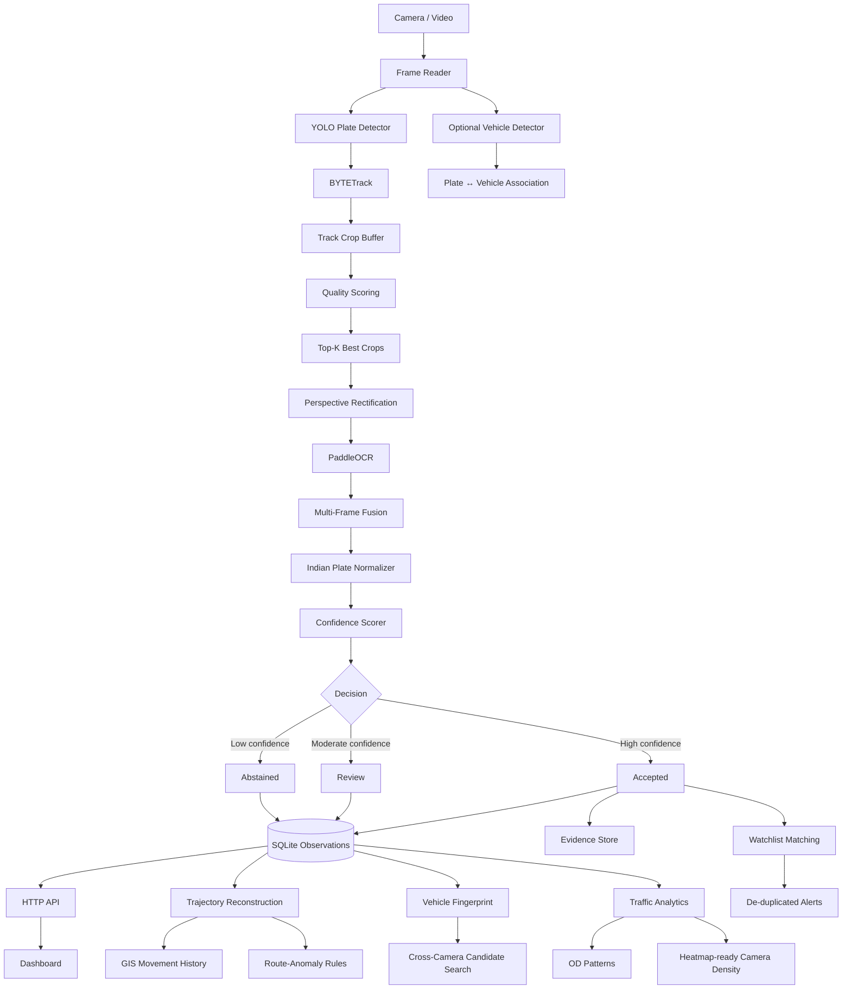

# 🏙️ CitySight

**Confidence-Aware Multi-Camera ANPR & Vehicle Intelligence Platform**

> Smart India Hackathon (SIH) 2026 · Problem Statement **26127**
> Repository: [`github.com/naman9p/citysight`](https://github.com/naman9p/citysight)

CitySight is a modular **ANPR, multi-camera tracking, traffic analytics, evidence management and vehicle-intelligence platform** for real-world road-video analysis.

It does not treat ANPR as a single-frame OCR problem. It combines detection, tracking, crop-quality selection, perspective rectification, OCR, temporal fusion, Indian plate normalization, confidence-aware decisions, camera topology, trajectory reconstruction, vehicle fingerprints, cross-camera candidate search, watchlist alerts, GIS-aware movement history and city-level traffic analytics.

---

## Table of Contents

1. [Overview](#1-overview)
2. [At a Glance](#2-at-a-glance)
3. [System Architecture](#3-system-architecture)
4. [Phase 1 — ANPR Engine](#4-phase-1--anpr-engine)
5. [Canonical Observation Model](#5-canonical-observation-model)
6. [Persistence & Evidence Storage](#6-persistence--evidence-storage)
7. [Watchlist & Alerts](#7-watchlist--alerts)
8. [Phase 2 — City Intelligence](#8-phase-2--city-intelligence)
9. [Phase 3 — Evidence-Backed Inspection](#9-phase-3--evidence-backed-inspection)
10. [HTTP API](#10-http-api)
11. [Operator Dashboard](#11-operator-dashboard)
12. [Technology Stack & Repository Structure](#12-technology-stack--repository-structure)
13. [Getting Started](#13-getting-started)
14. [Testing](#14-testing)
15. [Validation](#15-validation)
16. [Design Principles](#16-design-principles)
17. [Deployment Model & Known Boundaries](#17-deployment-model--known-boundaries)
18. [References](#18-references)
19. [Summary](#19-summary)

---

## 1. Overview

### 1.1 Problem

Traditional ANPR processes one frame at a time and can fail when a plate is:

- blurred by motion, captured at an angle, or affected by glare or poor lighting
- partially occluded or too small in the frame
- read differently across consecutive frames
- confused with visually similar characters such as `O/0`, `B/8` and `I/1`

### 1.2 Approach

CitySight treats every vehicle track as a **sequence of evidence**. It collects multiple observations, keeps the best plate crops, runs OCR on selected evidence, fuses results across time, normalizes Indian registration formats, and then decides whether the result is **Accepted**, sent for **Review**, or **Abstained**.

At city level, the same observation stream supports:

- multi-camera movement reconstruction and GIS-aware trajectory history
- cross-camera candidate retrieval
- traffic-volume analytics and origin–destination aggregation
- route-anomaly alerts and watchlist / blacklist monitoring
- evidence-backed operator inspection

### 1.3 Core idea

> **A confidently wrong plate is worse than an uncertain plate.**

CitySight therefore avoids forcing an identity when the evidence is weak.

```text
Camera / Recorded Video
        ↓
Frame Ingestion → YOLO Plate Detection → BYTETrack Tracking
        ↓
Plate Crop Collection → Quality Scoring → Top-K Best Frames
        ↓
Perspective Rectification → PaddleOCR → Multi-Frame OCR Fusion
        ↓
Indian Plate Normalization → Composite Confidence Scoring
        ↓
Accepted / Review / Abstained
        ↓
Canonical Observation Event → SQLite + Evidence Store
        ↓
Trajectory · Candidate Search · Alerts · Analytics · Dashboard
```

---

## 2. At a Glance

### 2.1 Capabilities

| Area | Capabilities |
|---|---|
| **ANPR core** | Licence-plate detection · OCR · BYTETrack tracking · Top-K crop selection · perspective rectification · multi-frame OCR fusion · Indian + BH-series normalization · Accepted / Review / Abstain decisions |
| **Storage & interfaces** | SQLite observation persistence · local evidence-image storage · HTTP API · operator dashboard |
| **Alerts** | Watchlist / blacklist alerts · alert de-duplication · route-anomaly rules |
| **Multi-camera** | Multi-camera replay · camera topology graph · GIS camera metadata · exact-plate trajectory reconstruction |
| **Vehicle intelligence** | Vehicle detection and plate association · vehicle fingerprinting · cross-camera candidate matching · Recall@K / HitRate@K / MRR evaluator |
| **City analytics** | Camera-density traffic analytics · heatmap-ready output · origin–destination aggregation |
| **Inspection** | Phase-3 evidence and query inspection |

### 2.2 Documented validation snapshot

| Metric | Value |
|---|---:|
| Detector precision @ IoU 0.50 | **92.68%** (620 / 669) |
| Detector recall @ IoU 0.50 | **94.80%** (620 / 654) |
| OCR exact match | **91.53%** (594 / 649 crops) |
| Automated-test snapshot | **691 passing** |
| Real-world replay | 2 cameras · 1080p · 30 FPS · ~5 min each |

Full counts and context are in [§15 Validation](#15-validation).

---

## 3. System Architecture



---

## 4. Phase 1 — ANPR Engine

Phase 1 converts raw road video into canonical ANPR observations.

### 4.1 Video ingestion

The reader supports configurable frame-processing rates: the source can run at a higher FPS while CitySight processes a controlled subset of frames. Recorded-video start times can be supplied to convert video-relative timestamps into timezone-aware observation timestamps.

```yaml
video:
  input_path: "inputs/videos/sample.mp4"
  camera_id: "cam_01"
  process_fps: 5
  resize_width: null
  resize_height: null
```

### 4.2 Licence-plate detection

An Ultralytics YOLO detector localizes plates. Detections go to the tracker instead of triggering OCR on every detection.

```yaml
detection:
  weights_path: "weights/plate_detector.pt"
  device: "cpu"
  confidence_threshold: 0.35
  iou_threshold: 0.45
  plate_class_id: 0
  image_size: 640
```

### 4.3 Temporal tracking (BYTETrack)

Detections of the same physical plate across frames are grouped into one track. This avoids repeated independent OCR decisions, builds a pool of plate views, improves resistance to blur and occlusion, enables quality-based frame selection and reduces redundant OCR work. Tracking thresholds and track-buffer settings are configurable.

### 4.4 Plate quality scoring

Not every crop is equally useful for OCR. Crops are scored on sharpness, plate size, brightness, contrast and minimum dimensions.

```yaml
quality:
  min_plate_width: 60
  min_plate_height: 20
  min_sharpness: 100.0
  target_area: 8000
  top_k: 3
  sharpness_weight: 0.4
  size_weight: 0.3
  brightness_weight: 0.15
  contrast_weight: 0.15
```

### 4.5 Top-K evidence selection

A vehicle can stay visible for many frames, and OCR on every frame is inefficient and can amplify noisy predictions. CitySight keeps only the **Top-K highest-quality crops per track**. With `top_k: 3`, a track with dozens of detections needs OCR on only three crops.

| Path | Work |
|---|---|
| **Fast path** | Detection, tracking, crop collection |
| **Heavy path** | Rectification, OCR, fusion |

### 4.6 Perspective rectification

Real road plates are often angled relative to the camera. Selected crops are transformed to a more OCR-friendly orientation before recognition, which improves text recognition on non-frontal views.

### 4.7 PaddleOCR

The OCR stage uses **PaddleOCR 3.7**. Its output is one evidence source for the later fusion and confidence stages, not a final answer.

```yaml
ocr:
  engine: "paddleocr"
  device: "cpu"
  language: "en"
  min_char_confidence: 0.4
  min_plate_length: 4
  max_plate_length: 12
```

### 4.8 Multi-frame OCR fusion

Different frames can produce slightly different strings:

```text
Frame 1 → GJ06LE6897
Frame 2 → GJ06LE6B97
Frame 3 → GJ06LE6897
```

Instead of accepting the second reading on its own, CitySight uses temporal agreement across the track. This helps with ambiguities such as `O↔0`, `B↔8`, `I↔1`, `S↔5` and `Z↔2`.

### 4.9 Indian licence-plate normalization

The normalizer removes unsupported characters, converts text to a canonical form, validates Indian registration structure, recognizes state / UT codes, and supports standard and **BH-series** plates.

```yaml
normalization:
  patterns:
    standard: "^[A-Z]{2}[0-9]{1,2}[A-Z]{1,2}[0-9]{4}$"
    bh_series: "^[0-9]{2}BH[0-9]{4}[A-Z]{1,2}$"
```

### 4.10 Confidence-aware decision layer

| State | Meaning |
|---|---|
| **Accepted** | Evidence is strong enough for automatic downstream use |
| **Review** | Useful evidence, but uncertainty is high enough that human verification is preferred |
| **Abstained** | Not enough evidence to safely assert a plate identity |

The final score combines several evidence sources rather than OCR confidence alone.

```yaml
confidence:
  min_observations: 2
  accept_threshold: 0.6
  review_threshold: 0.4
  ocr_weight: 0.35
  quality_weight: 0.15
  detector_weight: 0.15
  support_weight: 0.15
  validity_weight: 0.2
```

---

## 5. Canonical Observation Model

Every completed ANPR decision becomes a canonical observation event. The ANPR engine, persistence layer, APIs, trajectory engine, alerts, analytics and cross-camera modules all share this data contract.

```text
event_id              camera_id             track_id
timestamp             plate_raw             plate_normalized
confidence            status                detector_confidence
ocr_confidence        quality_score         best_frame_number
plate_image_path      model_version
```

---

## 6. Persistence & Evidence Storage

Lightweight local persistence suits the prototype and SIH demonstration environment.

| Component | Details |
|---|---|
| **SQLite** | Stores canonical observations: event ID, camera ID, track ID, timestamp, raw and normalized plate, decision status, confidence values, crop-quality metadata, evidence reference, model version. Indexed for camera/time and normalized-plate lookup. |
| **Evidence store** | Evidence images on the local filesystem, referenced by the database. The storage abstraction is separate from the pipeline so it can later be replaced by object storage without changing ANPR logic. |

---

## 7. Watchlist & Alerts

Accepted plate observations are compared against a configured watchlist.

- add plates and match on normalized plates
- persistent watchlist entries and alert creation
- duplicate-alert suppression, so a continuously tracked vehicle does not alert on every frame
- alert retrieval through the API and dashboard visualization

---

## 8. Phase 2 — City Intelligence

### 8.1 Multi-camera replay

Deterministic replay of multiple recorded sources into the same observation and evidence stores. The real-world configuration has two independently recorded cameras on a shared city-level timeline.

```yaml
scenario_id: step33-real-multicamera-01

sources:
  - source_id: step33_cam01
    camera_id: CAM_01
    video_path: ../../inputs/videos/step33/CAM01.mp4
    start_time: "2026-09-19T12:40:12Z"

  - source_id: step33_cam02
    camera_id: CAM_02
    video_path: ../../inputs/videos/step33/CAM02.mp4
    start_time: "2026-09-19T12:40:08Z"
```

### 8.2 Camera topology & GIS layer

The road-camera network is a directed graph.

| Element | Fields |
|---|---|
| **Camera** | `camera_id`, `name`, `latitude`, `longitude`, `road_name`, `heading_deg`, `zone`, `enabled` |
| **Directed link** | `from_camera_id`, `to_camera_id`, `distance_m`, `road_name`, `travel_direction` |

```text
Example:  CAM_01 → CAM_02   ·   50 m   ·   eastbound
```

The graph drives trajectory reconstruction, candidate filtering, physical travel checks, GIS movement history, route-anomaly rules and dashboard camera visualization. The dashboard renders camera positions from configured latitude/longitude and shows topology links.

### 8.3 Single-plate trajectory reconstruction

For a plate query, the trajectory engine:

1. normalizes the requested plate
2. retrieves stored observations
3. uses only **accepted** sightings for automatic trajectories
4. sorts sightings chronologically
5. collapses repeated same-camera observations inside the duplicate window
6. attaches camera GIS metadata
7. creates transitions between consecutive sightings
8. calculates observed travel time
9. checks whether a direct topology link exists

```text
GJ06LE6897

12:40:16  CAM_01  Demo Junction 1
    ↓
12:41:02  CAM_02  Demo Junction 2
```

A trajectory holds sightings and transitions, including camera sequence, timestamps, latitude / longitude, road names, travel direction, transition time, direct-link status and distance when topology data is available.

### 8.4 Vehicle detection & plate association

Plate observations can optionally be enriched with the surrounding vehicle. The association is geometric and does not invent a combined confidence score. A vehicle candidate must satisfy:

- same frame
- plate center inside the vehicle bounding box
- minimum plate-containment ratio
- deterministic tie-breaking when several vehicle boxes qualify

### 8.5 Vehicle fingerprinting

Cross-camera search should not depend only on exact string equality. A fingerprint can contain `normalized_plate`, `vehicle_colour` and `vehicle_class`. The default weighting gives the strongest importance to normalized plate evidence, with colour and class adding evidence when available.

A comparison reports evidence coverage, matched weight, contradicted weight, net evidence, overall similarity and an explainable outcome. Fingerprint similarity is **evidence, not a confirmed vehicle identity**.

### 8.6 Cross-camera candidate matching

The matcher combines plate evidence, fingerprint similarity, source and destination cameras, link direction, timestamps, elapsed travel time, road distance, maximum-speed constraints and evidence coverage.

| Outcome | Meaning |
|---|---|
| `ineligible` | Pair not eligible for comparison |
| `physically_impossible` | Fails topology / travel-time / speed checks |
| `insufficient_evidence` | Too little evidence to compare |
| `identity_conflict` | Evidence contradicts a shared identity |
| `possible_weak` | Plausible, weak evidence |
| `possible_strong` | Plausible, strong evidence |

This keeps matching explainable and never automatically claims that two observations are the same vehicle.

### 8.7 Candidate search & retrieval evaluation

Candidate collection is bounded. When external ground-truth relationships are supplied, retrieval is evaluated with:

| Metric | Meaning |
|---|---|
| **Recall@K** | Fraction of relevant sightings retrieved within the first K candidates |
| **HitRate@K** | Fraction of queries with at least one relevant candidate in the first K |
| **MRR** | Average reciprocal rank of the first relevant candidate |

The evaluator requires explicit ground truth and never derives labels from the same plate or fingerprint the matcher uses.

### 8.8 Traffic analytics

Built from persisted observations and camera topology.

| Output | Contents |
|---|---|
| **Camera-level volume** | Total and accepted observation counts, camera name, road name, zone, latitude, longitude, heading, normalized heatmap weight |
| **Hourly flow** | Observation timestamps grouped into hourly buckets |
| **Heatmap-ready output** | Camera counts normalized to heatmap weights |

Heatmap values represent **observed ANPR track volume**, not formal roadway-capacity congestion estimates.

### 8.9 Origin–destination analytics

For each accepted plate with sightings at more than one camera, CitySight derives `Origin camera → Destination camera` and aggregates OD camera-pair counts, camera-transition counts and the total number of accepted multi-camera trajectories. This is the foundation for city-level movement-flow analysis.

### 8.10 Route-anomaly alerts

Rule-based analysis over accepted observations.

| Anomaly | Trigger |
|---|---|
| **Topology gap** | Consecutive sightings have no direct configured topology link |
| **Implausible speed** | On a direct link, `link distance / elapsed travel time` exceeds the configured threshold |

These are **operational indicators**, not automatic legal violations or identity assertions.

---

## 9. Phase 3 — Evidence-Backed Inspection

A separate, read-only evidence and query-inspection layer. It supports persisted vehicle evidence, query-history retrieval, candidate-result inspection, appearance metadata and trajectory-hypothesis construction from explicitly selected query histories.

```text
Exact trajectory
    = accepted plate observations already stored by CitySight

Inferred trajectory hypothesis
    = evidence-backed possible path assembled from selected candidate histories
```

The Phase-3 API does not silently mutate evidence or turn candidate hypotheses into confirmed identities.

---

## 10. HTTP API

CitySight uses Python's standard-library `http.server`, not a web framework.

| Group | Endpoints |
|---|---|
| **Observations** | `GET /health` · `GET /observations` · `GET /observations/{event_id}` · `GET /plates/{plate}/observations` · `GET /cameras/{camera_id}/observations` |
| **Watchlist & alerts** | `GET /watchlist` · `POST /watchlist` · `DELETE /watchlist/{watchlist_id}` · `GET /alerts` |
| **Topology** | `GET /v1/cameras` · `GET /v1/cameras/{camera_id}` · `GET /v1/cameras/{camera_id}/links` · `GET /v1/links` |
| **Trajectory** | `POST /v1/trajectories` |
| **Analytics** | `GET /v1/analytics/traffic` · `GET /v1/analytics/origin-destination` · `GET /v1/alerts/route-anomalies` |
| **Phase 3 (optional)** | `GET /v1/phase3/evidence/{event_id}` · `GET /v1/phase3/queries/{query_id}` · `GET /v1/phase3/queries/{query_id}/results` · `GET /v1/phase3/hypotheses/{root_event_id}?query_id=...` |

Example trajectory request:

```json
{
  "plate": "GJ06LE6897"
}
```

---

## 11. Operator Dashboard

Plain **HTML + CSS + Vanilla JavaScript**, served by the existing Python HTTP server. The front end uses API responses, never direct database access.

- recent ANPR observations, exact plate search, confidence / decision status
- watchlist management and recent alerts
- camera topology visualization
- Phase-3 evidence inspection, stored candidate query history and trajectory hypotheses (when Phase 3 is enabled)

---

## 12. Technology Stack & Repository Structure

### 12.1 Stack

| Layer | Technology |
|---|---|
| Language | Python 3.11+ |
| Computer vision | OpenCV |
| Plate detection | Ultralytics YOLO |
| Tracking | BYTETrack |
| OCR | PaddleOCR 3.7 |
| Numeric processing | NumPy |
| Validation / models | Pydantic |
| Configuration | PyYAML |
| Persistence | SQLite |
| Evidence | Local filesystem |
| API server | Python `http.server` |
| Dashboard | HTML / CSS / Vanilla JavaScript |
| Testing | pytest |

The prototype deliberately avoids Redis, Kafka, Kubernetes and mandatory cloud services.

### 12.2 Repository structure

```text
citysight/
├── contracts/                  # Canonical event/data contracts
├── docs/                       # Project documentation
├── inputs/                     # Input videos / evaluation assets
├── outputs/                    # Generated observations and evidence
├── weights/                    # Local model weights
│
├── phase1_anpr/
│   ├── api/                    # HTTP API + dashboard
│   ├── confidence/             # Composite confidence scoring
│   ├── config/                 # ANPR configuration
│   ├── detection/              # Plate detector
│   ├── evaluation/             # Benchmark / annotation infrastructure
│   ├── normalization/          # Indian plate normalization
│   ├── observation/            # Canonical observation creation
│   ├── ocr/                    # PaddleOCR integration
│   ├── persistence/            # SQLite + evidence store
│   ├── pipeline/               # End-to-end ANPR pipeline
│   ├── quality/                # Crop quality scoring
│   ├── rectification/          # Perspective correction
│   ├── tracking/               # BYTETrack integration
│   ├── video/                  # Video ingestion
│   ├── demo.py                 # Phase-1 / multi-source replay runner
│   └── serve.py                # API + dashboard server
│
├── phase2_city/
│   ├── candidate_collection.py
│   ├── candidate_evaluation.py
│   ├── candidate_evaluation_runner.py
│   ├── candidate_report.py
│   ├── cross_camera_matching.py
│   ├── fingerprint.py
│   ├── graph.py
│   ├── plate_vehicle_association.py
│   ├── replay.py
│   ├── traffic_analytics.py
│   ├── trajectory.py
│   ├── vehicle_attributes.py
│   ├── vehicle_detection.py
│   └── config/
│
├── phase3_city/
│   ├── api.py
│   ├── appearance_comparison.py
│   ├── appearance_embedding.py
│   ├── evidence_persistence.py
│   ├── historical_candidate_retrieval.py
│   ├── hybrid_matching.py
│   ├── query_history.py
│   └── trajectory_hypotheses.py
│
├── tests/                      # Unit + integration tests
├── requirements.txt
├── run.py
└── README.md
```

---

## 13. Getting Started

### 13.1 Install

```bash
git clone https://github.com/naman9p/citysight.git
cd citysight
```

Create a virtual environment:

```bash
# Windows
python -m venv .venv
.venv\Scripts\activate

# Linux / macOS
python -m venv .venv
source .venv/bin/activate
```

Install dependencies:

```bash
pip install -r requirements.txt
```

Main dependencies: `numpy`, `pyyaml`, `pydantic`, `jsonschema`, `opencv-python`, `ultralytics`, `lap`, `paddleocr==3.7.0`, `paddlepaddle==3.3.1`, `pytest`.

### 13.2 Model weights

CitySight expects detector weights locally and does **not** download them at runtime. Default path: `weights/plate_detector.pt`. Configure it in `phase1_anpr/config/config.yaml`.

### 13.3 Run the ANPR pipeline

```bash
python -m phase1_anpr.demo \
  --config phase1_anpr/config/config.yaml
```

Optional overrides:

```bash
python -m phase1_anpr.demo \
  --config phase1_anpr/config/config.yaml \
  --video inputs/videos/sample.mp4 \
  --camera-id CAM_01 \
  --source-id sample_run
```

Observations and evidence are written to the configured persistence paths.

### 13.4 Run the two-camera replay

```bash
python -m phase2_city.replay \
  --scenario phase2_city/config/replay.step33.yaml \
  --city-config phase2_city/config/city.step33.yaml \
  --config phase1_anpr/config/config.step33.yaml
```

The replay shares observation, evidence and watchlist stores across camera sources.

### 13.5 Run the API and dashboard

```bash
python -m phase1_anpr.serve \
  --config phase1_anpr/config/config.yaml \
  --city-config phase2_city/config/city.yaml \
  --host 127.0.0.1 \
  --port 8000
```

Open `http://127.0.0.1:8000/dashboard`. When the city configuration is available, topology and trajectory features are enabled automatically.

### 13.6 Run the cross-camera candidate evaluator

```bash
python -m phase2_city.candidate_evaluation_runner \
  --scenario <scenario.yaml> \
  --ground-truth <ground_truth.yaml> \
  --k 1 3 5 \
  --candidate-window-seconds <seconds> \
  --candidate-max-results <count> \
  --candidate-maximum-speed-kph <speed> \
  --city-config <city.yaml> \
  --config <config.yaml>
```

Outputs: candidate Recall@K, HitRate@K, MRR, truncation diagnostics and per-case candidate ranks.

---

## 14. Testing

```bash
pytest -q
```

The repository documentation records a snapshot of **691 passing automated tests**. Additional analytics/API tests were added after that snapshot, so re-run the suite before changing the published count.

Coverage: detection, tracking, OCR, normalization, confidence scoring, crop quality, persistence, API and dashboard behavior, watchlist logic, trajectory reconstruction, city topology, replay, vehicle detection, plate association, fingerprinting, cross-camera candidate collection, candidate evaluation, Phase-3 evidence, query history, trajectory hypotheses and traffic analytics.

---

## 15. Validation

### 15.1 Documented snapshot

| Metric | Documented value |
|---|---:|
| Detector precision @ IoU 0.50 | **92.68%** |
| Detector recall @ IoU 0.50 | **94.8%** |
| OCR exact match | **91.53%** |
| OCR evaluation crops | **649** |
| Automated-test snapshot | **691 passing** |

### 15.2 Raw counts

| Detector | | OCR | |
|---|---:|---|---:|
| Ground-truth plates | 654 | Ground-truth crops | 649 |
| Predictions | 669 | Exact matches | 594 |
| True positives | 620 | Failures | 55 |
| False positives | 49 | | |
| False negatives | 34 | | |

```text
Precision = 620 / 669 = 92.68%
Recall    = 620 / 654 = 94.80%
OCR exact = 594 / 649 ≈ 91.53%
```

The repository also contains a separate Step-34 real-world ground-truth benchmark workflow whose full population-level annotation and evaluation is still described in the development notes as incomplete. For publication-quality reporting, benchmark figures should stay tied to their exact dataset and run artifacts.

### 15.3 Real-world replay

| Property | CAM_01 | CAM_02 |
|---|---|---|
| Resolution | 1080p | 1080p |
| Frame rate | 30 FPS | 30 FPS |
| Duration | ~5 min | ~5 min |
| Environment | Real road traffic | Real road traffic |
| Replay | Offline multi-camera | Offline multi-camera |

The replay exercises the full chain: `video → detector → tracker → crop selection → OCR → fusion → normalization → decision → persistence → city-level processing`.

---

## 16. Design Principles

| Principle | What it means |
|---|---|
| **Explainability** | Cross-camera outputs expose evidence, topology state, travel status and reasons, not only an opaque score |
| **Confidence awareness** | Low-confidence observations go to Review or Abstain instead of forcing an identity |
| **Determinism** | Replay, ranking, ground-truth evaluation, persistence and candidate evaluation are reproducible |
| **Modularity** | Detection, OCR, tracking, persistence, trajectory logic, matching, analytics and APIs are separate modules |
| **Lightweight deployment** | Local files, SQLite and the standard-library HTTP server avoid unnecessary distributed infrastructure |
| **Evidence preservation** | Original plate crops and observation metadata are retained for later inspection |

---

## 17. Deployment Model & Known Boundaries

### 17.1 Current prototype

```text
Camera / Video → CitySight Python Worker → SQLite + Local Evidence Store → Stdlib HTTP API → Dashboard
```

A larger deployment can replace components behind the existing interfaces:

| Prototype | Larger deployment |
|---|---|
| SQLite | PostgreSQL / distributed database |
| Local filesystem | Object storage |
| Single worker | Distributed inference workers |
| Local API | Authenticated API gateway |

### 17.2 Known boundaries

CitySight is an engineering prototype, not a nationwide production deployment.

- performance depends on detector weights and camera quality
- severe blur, occlusion and extreme plate angles can still reduce usable plate evidence
- OCR and cross-camera performance should always be reported against a defined labeled dataset
- vehicle colour / class enrichment is optional
- candidate matches are hypotheses, not automatic identity assertions
- route anomalies are rule-based indicators
- SQLite and local filesystem storage are prototype choices, not final city-scale infrastructure
- large-camera-fleet throughput needs separate hardware and load benchmarking

---

## 18. References

| Component | Reference |
|---|---|
| Detection | YOLO / Ultralytics |
| Tracking | BYTETrack |
| OCR | PaddleOCR 3.7 |
| Image / video processing | OpenCV |

These are integrated into CitySight's own confidence-aware, multi-frame, multi-camera pipeline rather than used as isolated demonstrations.

---

## 19. Summary

**ANPR intelligence**
```text
Detection → Tracking → Best-frame selection → Rectification → OCR
→ Multi-frame fusion → Indian plate normalization → Confidence decision
```

**Multi-camera vehicle intelligence**
```text
Canonical observations → GIS camera topology → Exact-plate trajectory
→ Vehicle fingerprint → Cross-camera candidates → Retrieval evaluation
```

**City-level operations**
```text
Observation database → Watchlist alerts → Traffic analytics → Origin–destination patterns
→ Heatmap-ready camera density → Route-anomaly rules → Dashboard / API
```

CitySight is not just an OCR script but an **evidence-aware ANPR and multi-camera vehicle-intelligence architecture** that connects computer vision with persistence, explainable decision logic, GIS context, analytics and operational interfaces.

---

**Project:** CitySight · **SIH Problem Statement:** 26127 · **Repository:** `github.com/naman9p/citysight`
